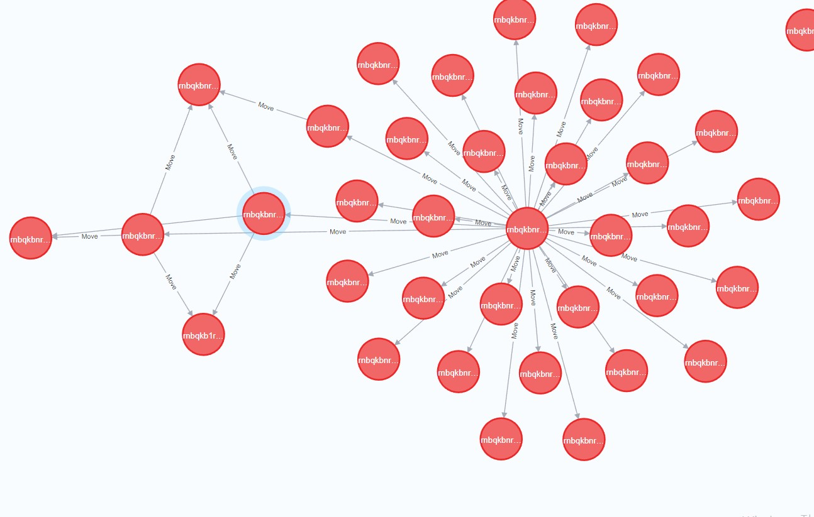
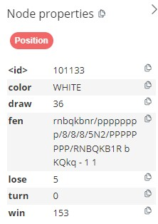
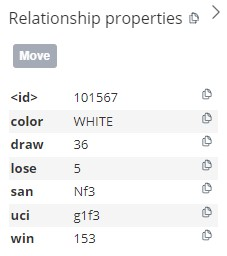
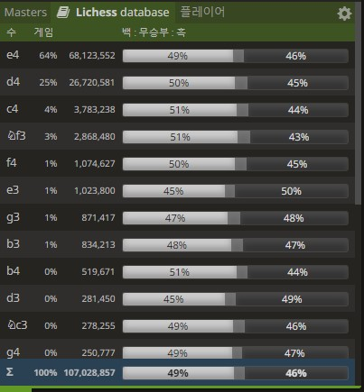

## 결론적으로 말하면 이 프로그램은 효과적이지 않습니다. 더 많은 발전이 필요합니다.
## Consequently speaking, the program is not effective and needs more development.  // English description below

궁금하신 점이나 하고픈 말이 있으시다면 minkuk0118@gmail.com 으로 연락 부탁드립니다. 감사합니다.

If you have any question or anything, please feel free to contact me : minkuk0118@gmail.com . Thank you.

윈도우 11 환경에서 개발하고 실행하였습니다.
Programmed & Executed in Winodows 11 environment

# 개요

저는 종종 유도나 체스같이, 1:1로 상대가 꼭 필요한 게임에서, 내가 나를 상대로 싸울 수 있으면 좋겠다고 생각했습니다.

일반적으로 나의 경기를 분석할 때, 우리는 시합이 끝난 후 복기하거나 다른 사람의 조언을 듣습니다.
그것보다 내가 직접 나를 상대하면서 나의 강점과 약점, 그리고 경기전략을 분석할 수 있다면 아주 좋을 것이라고 생각했습니다.

그래서 체스에서 나와 비슷한 성향으로 체스를 두는 프로그램을 만들고자 하였습니다.
구현하고자 하는 기능은,
1. 내가 둔 경기들을 수집하여 어떤 상황( position )에서 어떤 수( move )를 두었는지 파악하기
2. 내가 둔 경기들을 바탕으로 나와 비슷한 성향의 인공지능을 만들어서 대국하기  
입니다.

# 구현

체스는 상대와 내가 한 번씩 번갈아가며 수를 둡니다.
양 player는 자신에게 주어진 position을 보고, 가장 적합한 수( move)를 둡니다.

일반적으로 체스에서 position을 표현할때 FEN 이라는 형식을 따릅니다.
move를 표현할 때에는 SAN, UCI 형식을 모두 사용합니다.

## 1. 내가 둔 경기들을 수집하여 어떤 상황( position )에서 어떤 수( move )를 두었는지 파악하기

1 번의 기능을 구현하기 위하여, neo4j database를 이용하였습니다.

neo4j database의 APOC plugin을 이용하면,
Chess.com api를 이용해 특정 player가 둔 수를 수집할 수 있습니다. [1](#footnote_1)

가져온 게임들을 바탕으로 각 포지션에 대한 수를 그래프로 표현합니다.
( node는 position이고, node사이를 잇는 edge는 move입니다. )

## 2. 내가 둔 경기들을 바탕으로 나와 비슷한 성향의 인공지능을 만들어서 대국하기

구현하기 위하여 크게
a) 이미 player가 맞닥뜨렸던 position인 경우
b) player가 처음보는 position인 경우
로 나누어 구현하였습니다.

### a)
이미 player가 두어봤던 position은 neo4j database에 저장되어있습니다.
neo4j에 있는 position을 분석합니다.
해당 position에서 이미 두어보았던 수들 중, 승률 혹은 승률+무승부률( 이하 승-무승부률 )이 특정 기준을 넘는 수들 중 하나를 채택합니다.

실제 구현은,  
승률이 0.5를 초과하는 수  
없다면, 승-무승부률이 0.5를 초과하는 수  
없다면, 승률이 0.4를 초과하는 수  
없다면, 승-무승부률이 0.4를 초과하는 수  
없다면, 승-무승부률이 0.3을 초과하는 수  
없다면, 승-무승부률이 0.0을 초과하는 수  
없다면, b) 에서 구현할 기계학습을 통하여 새로운 수를 채택하는 방법으로 구현하였습니다.

채택할 때에는,
수를 두어봤던 횟수에 가중치를 두어 랜덤으로 채택합니다.

이를테면,  
특정 position에서 e4와 d4만이 승률이 0.5를 초과하는 수이며,
e4가 200번 두어졌고, d4가 100번 두어졌다면,
e4는 200/300의 확률로, d4는 100/300의 확률로 선택됩니다.

### b)
player가 두어본 적 없는 position에서는, player가 둔 수를 바탕으로 기계학습을 진행합니다.
position에 해당하는 FEN을 적절히 encoding 하여 입력으로 하고,
그에 따른 move를 출력으로 합니다.

### FEN encoding
14개의 channel, 8x8의 size를 가지는 tensor로 encoding 합니다.
우선 룩, 나이트, 비숍, 퀸, 킹, 폰이 있는 위치에 대하여 각 1개의 channel, 또 흑과 백을 별도로 표현해야 하므로 12개의 channel을 가집니다.
더하여 각 색깔의 기물이 어디를 공격하고 있는지 8x8 size로 표현합니다. 총 2개의 channel이 필요합니다.

최종적으로 14개의 channel을 가지는 8x8 size의 tensor를 입력으로 줍니다.

### move
출력이 되는 move는 from tensor ( 1x8x8 ), to tensor ( 1x8x8 )로 나누어 표현합니다.
from tensor에서 움직일 기물이 있는 칸을 고르고,
to tensor에서 from tensor에서 고른 기물을 움직일 칸을 고릅니다.

하여 총 2개의 model로 구현하였습니다.

### CNN
은 pooling 을 하여 기존의 8x8 사이즈의 체스판 size를 변형시키면 안 된다고 판단하였습니다.
Batch normalization 만 진행하였고 이는 youtube를 참고하여 구현하였습니다. [2](#footnote_2)

### Loss Function

오차함수는 softmax ( torch.nn.CrossEntropyLoss() ) 를 사용하였습니다.
from move 에 대한 model 과
to move 에 대한 model을 따로 계산하였습니다.

### move 선택
가능한 legal moves 중 from tensor 값과 to tensor 값의 합이 가장 큰 move를 선택합니다.

# 결과
DB에 있는 수들을 제외하고, 기계학습을 통해 선택한 수들을 지켜봤을 때,
몇몇 개의 수는 논리적이고 괜찮은 수를 두지만
많은 경우에 비상식적인 수를 둡니다.

* lichess.org 이라는, 전세계 플레이어들이 해당 사이트에서 둔 수를 DB에 저장하고 무료로 제공하는 사이트가 있습니다.
* 테스트를 위해 해당 사이트를 사용하였습니다. 특정 position에서 가장 많이 두어진 수를 고를 예정입니다.

## 1 ) Chess.com 레이팅 1200대인 사람이 Rapid ( 서로 10분 내외의 시간을 가지고 두는 게임 ) 룰을 바탕으로 둔 게임을 학습시켰을 때
batch size = 1024, epochs = 1000, lr = 1e-5
경기수 : 3,668 게임

### Engine이 백
### MyLittleEngine vs. lichess.org DB ( 1200대의 rapid 레이팅 = 대략 Chess.com rapid 레이팅 1025와 같음 [3](#footnote_3) ) 

1.e4 e5 2. Nf3 Nc63. Bc4 Nf6 4. Ng5 d5 5. exd5 Nxd5 6. Nxf7 Kxf7 7. Qf3+ Ke8 8. Bxd5 Nd4 9. Qf7# 1-0

-Neo4j DB에 있는 move들 만으로 Engine 승 

### MyLittleEngine vs. lichess.org DB ( 1800대의 rapid 레이팅 = 대략 Chess.com rapid 레이팅 1470 )

1.e4 e5 2. Nf3 Nc6 3. Bc4 Nf6 4. Ng5 d5 5. exd5 Na5 6. Bb5+ c6 7. dxc6 bxc6 8. Bd3 h6 9. Ne4 Nxe4 10. Bxe4 Bc5 **( 여기서부터, 기계학습으로 선택하는 수 )**11. Nc3 O-O 12. d3 f5 13. Bd5+??? **( 어이없는 실수 .. 더이상 lichess.org DB에 move가 존재하지 않아서 여기서부터는 제가 직접 흑으로 두었습니다. )** cxd5 14. d4 Bxd4 15. Qxd4 exd4 16. Bf4 dxc3 17. bxc3 Qe7+ 18. Kd2 Nc4+ 19. Kd3 Ba6 20. g3 Nd6+ 21. c4 Qe4+ 22. Kd2 Nxc4+ 23. Kd1 Qxh1+ 24. Ke2 Qxa1 25. c3 Qxc3 26. a3 Ne5+ 27. Kd1 Qd3+ 28. Bd2 Rab8 29. g4 Rb1#   0-1

----
### Engine이 흑
### lichess.org DB ( 1200대의 rapid 레이팅 = 대략 Chess.com rapid 레이팅 1025와 같음 )  vs. MyLittleEngine

1.e4 e6 2. d4 c5 3. Nf3 cxd4 4. Nxd4 Nc6 5. Nxc6 bxc6 6. Nc3 Nf6 7. Bg5 Bb4 8. e5 **( 여기서부터, 기계학습으로 선택하는 수 )**  Nd5??? 9. Bxd8 Bxc3+ **( 마찬가지로 더이상 lichess.org DB에 move가 존재하지 않아 제가 직접 백으로 두었습니다. )** 10. bxc3 Nc7 11. Bxc7 d5 12. exd6 Ba6 13. Bxa6 Rb8 14. Bxb8 O-O 15. d7 Rxb8 16. d8=Q+ Rxd8 17. Qxd8#    1-0

### lichess.org DB ( 1800대의 rapid 레이팅 = 대략 Chess.com rapid 레이팅 1470 )  vs. MyLittleEngine

1.e4 c5 2. Nf3 e6 3. d4 cxd4 4. Nxd4 Nc6 5. Nc3 Qc7 6. Be3 a6 7. Be2 **( 여기서부터, 기계학습으로 선택하는 수 )** Nf6 8. O-O Bd6 9. f4 O-O 10. e5 Bb4 **( 더이상 lichess.org DB에 move가 존재하지 않아 제가 직접 백으로 두었습니다. )** 11. exf6 d6 12. Qd3 Ne5??? 13. fxe5 Qxc3??? 14. bxc3 Bc5 15. Rf3 Re8 16. Rg3 Bb6 17. Rxg7+ Kh8 18. Qxh7#   1-0

## 2 ) Chess.com 레이팅 3300대, FIDE 레이팅 2800+ 인 프로게이머 Hikaru 가 Blitz 룰을 바탕으로 둔 게임을 학습시켰을 때
batch size = 1024, epochs = 500, lr = 1e-5

### Engine이 백
### MyLittleEngine vs. lichess.org DB ( 1200대의 rapid 레이팅 = 대략 Chess.com rapid 레이팅 1025와 같음 ) 

1.e4 e5 2. Bc4 Nf6 3. d3 Bc5 4. Nf3 d6 5. c3 Ng4 6. Nbd2 Nxf2 **( 여기서부터, 기계학습으로 선택하는 수 )** 7. O-O??? Nxd1+ 8. Rf2 **( 더이상 lichess.org DB에 move가 존재하지 않아 제가 직접 흑으로 두었습니다. )** Bxf2+  9. Kf1 Qf6 10. Nb3 Bg4 11. Ke2 Bxf3+ 12. gxf3 Nxc3+ 13. Kxf2 Qh4+ 14. Ke3 Qxh2 15. Ba6??? bxa6 16. Na5 Qe2#  0-1

### MyLittleEngine vs. lichess.org DB ( 1800대의 rapid 레이팅 = 대략 Chess.com rapid 레이팅 1470 )

1.e4 e5 2. Nc3 Nf6 3. Bc4 Bc5 4. d3 d6 5. Qf3 Bg4 **( 여기서부터, 기계학습으로 선택하는 수 )** 6.h3??? **( 더이상 lichess.org DB에 move가 존재하지 않아 제가 직접 백으로 두었습니다. )** Bxf3 7. Nxf3 O-O 8. Be6 Qe7 9. O-O Qxe6 10. Re1 Nc6 11. Nh4 Nd4 12. Nd5 Nxd5 13. c3 Nf4 14. cxd4 Bxd4 15. g3 Nxd3 16. Re3 Bxe3 17. Bxe3 Qxh3 18. Ng6 fxg6 19. Re1 Nxe1 20. f3 Qg2#  0-1

-너무 어이없는 실수가 많음 ..

----
### Engine이 흑
### lichess.org DB ( 1200대의 rapid 레이팅 = 대략 Chess.com rapid 레이팅 1025와 같음 )  vs. MyLittleEngine

1.e4 e5 2. Nf3 Nc6 3. Bc4 Nf6 4. Ng5 d5 5. exd5 Na5 6. Bb5+ c6 7. dxc6 bxc6 8. Ba4 **( 여기서부터, 기계학습으로 선택하는 수 )** Qd3 **( ... 더이상 lichess.org DB에 move가 존재하지 않아 제가 직접 백으로 두었습니다. )** 9. cxd3 Be6 10. Nxe6 fxe6 11. Qc2 Nb3 12. axb3 Bb4 13. Qxc6+ Kd8 14. Qxa8+ Kc7 15. Qxh8 Bc3 16. Qxg7+ Kd8 17. Qxf6+ Kc7 18. Qxe6 Bd4 19. Bd7 Kb8 20. Bc6 Bc3 21. Qd7 Bxd2+ 22. Bxd2 a6 23. Qb7#  1-0
-역시 너무 많은 블런더 ..  !  

### lichess.org DB ( 1800대의 rapid 레이팅 = 대략 Chess.com rapid 레이팅 1470 )  vs. MyLittleEngine

1.e4 c6 2. d4 d5 3. e5 Bf5 4. Nf3 e6 5. Bd3 **( 여기서부터, 기계학습으로 선택하는 수 )** Bxd3 6. Qxd3 a5 7. O-O Na6 8. Bg5 Qe7??? **( 더이상 lichess.org DB에 move가 존재하지 않아 제가 직접 백으로 두었습니다. )** 9. Bxe7 Nxe7 10. Qb3 Ng6 11. Qxb7 Nc7 12. Qxc7 Rc8 13. Qxc8+ Ke7 14. Ng5 Rg8 15. Nxh7 Nf4 16. Qc7+ Ke8 17. Qxc6+ Ke7 18. Qd6+ Ke8 19. Qc6+ Ke7 20. Nc3 Ne2+ 21. Nxe2 g5 22. Nf6 Kd8 23. Qd7#  1-0

# 발전할 점

a ) 좀 더 많은 경기를 학습시키면 좋을지 ?

b ) FEN을 CNN으로 학습시키기 좋게 encoding하였는데, encoding 하는 방법 중 더 좋은 방법이 있었던 것은 아닐지 ?

c ) 수를 선택하는 과정에서 발전할 수 있는 것은 아닌지 ?

정도 생각해볼 수 있었습니다.
encoding 방법 등 대부분의 의사결정에서 '좀 더 그럴듯한' 방향을 선택했는데, 학술적인 기반이 있었더라면 더 좋았을 것 같습니다.
이 프로젝트는 성능 향상을 목표로 한 것이 아니었습니다.
변명하자면 그래서 더 선행 연구를 찾기에 어렵지 않았나 생각합니다.

-------------------------------------

# 실행해보고 싶다면

chess.py , pytorch, neo4j.py 를 install 하시고, neo4j DB를 다운로드 받아야합니다.

그 후 neo4j DB를 실행시키고, APOC plugin을 활성화 합니다.  
( 필요하다면 neo4j DB의 dbms.memory.transaction.total.max 제한을 없애야 ( = 0 ) 동작할 수 있습니다. )

db.py의 parameter들을 수정한 후 실행시키면 됩니다.

--------------------------------------

# Abstract

I've often thought that I could fight against myself in games like judo or chess, where you need an opponent to play with.  
Usually, when we analyze our game, we review it after the match or gather someone else's advice. Rather, I thought it would be great if I could analyze myself by playing against myself. I thought that by fighting against me, I would be able to analyze my strengths and weaknesses etc..

Especially in Chess, I would like to make a program ( or chess engine ) that plays chess with similar tendencies to myself.
Features that I wanted to implement are the following:

1. Gathering my actual games so that understand myself that which move I made in which position.

2. Based on my actual games, make a chess engine that has similar tendencies to me  
( & actually play games against that engine )

# Implementation

In chess, you and your opponent take turns to make a move.
Both players analyze their positions and make the most proper move. ( or winnable )

Generally, when representing a certain position in chess, we use FEN form.
plus when it comes to a certain move, we use UCI or SAN form.

## 1. Gathering my actual games so that understand myself that which move I made in which position.

To implement number 1. feature, I would use Neo4j Database.
Using the APOC plugin in the Neo4j Database, we could collect games and moves played by a certain player with Chess.com API. [1](#footnote_1)

Graph the moves for each position based on the gathered games.
( A node is a position, and an edge is a move )

## 2. Based on my actual games, make a chess engine that has similar tendencies to me  ( & actually play games against that engine )

When implementing number 2. feature, we noticed that there are two situations dealing with a position.
a ) a position that a player has already played before
b ) a position that a player has never been before

### a ) a position that a player has already played before

A move & a position that a player has already seen before have existed in Neo4j Database.
Therefore we would analyze a position in Database.
Amongst moves that are already played in a particular position, I would pick one where the win rate or win+draw rate is above a certain threshold.

In acutal implementation,  
pick a move that its win rate is greater than 0.5  
If that doesn't exist, pick one that its win+draw rate is greater than 0.5  
If that doesn't exist, pick one that its win rate is greater than 0.4  
If that doesn't exist, pick one that its win+draw rate is greater than 0.5  
If that doesn't exist, pick one that its win+draw rate is greater than 0.4  
If that doesn't exist, pick one that its win+draw rate is greater than 0.0  
If that doesn't exist at all, pick one that is generated by the chess engine, which will be implemented in the b ) situation.

When it comes to picking one of moves that meet the criteria,  
I would randomly pick one by weighing the number of times it has been played.

For example,  
In a certain position, where e4 and d4 are the only moves with a win rate greater than 0.5,
If e4 has been played 200 times and d4 has been played 100 times,
e4 is chosen with a probability of 200/300 and d4 with a probability of 100/300.

### b ) a position that a player has never been before

I would do machine learning based on games player played.
INPUT, is appropriately encoded FEN
OUTPUT, is a move

### FEN encoding
I encoded it as a tensor with 14 channels, and each size is 8x8.
There would be one channel each for the positions of Rook, Knight, Bishop, Queen, King, and Pawn.
12 channels are needed because I would like to represent black and white separately.

In addition, 8x8 size tensors are needed to represent where each piece is attacking.
required for both colors, we need 2 more channels to do so.

In total, I encoded FEN as a tensor with 14 channels, and each size is 8x8.

### move
A move is represented in divided way, which are from_tensor ( 1x8x8 ) and to_tensor ( 1x8x8 )
In the from tensor, we would a square with a piece to move.

In the to tensor, we would a square to move the piece.

Therefore I would implement them in 2 models.

### CNN

I would thought that 8x8 size chess board should not be modification with size by pooling.
so that I would apply Batch normalization only.
I implemented it as watched Youtube Video. [2](#footnote_2)

### Loss Function.

Loss Function is Softmax ( torch.nn.CrossEntropyLoss() )
to choose a square out of 64 squares.

### pick a move
select a move where the sum of the from_tensor value and the to_tensor value is the maximum, among the legal moves.

# Conclusion
Looking at the moves selected by an engine, some of them are logical and make sense,
but in many cases they are illogical.

* There is a free site that named lichess.org, which presents free database of played game in lichess.org
* I used it for testing my engine. ( by piciking most played move in a certain position )

## 1 ) Trained by data of a person with a Chess.com rating 1200s ( Rapid rule )
batch size = 1024, epochs = 1000, lr = 1e-5
3,668 games.
### Engine plays White
### MyLittleEngine vs. lichess.org DB ( near 1200 rapid rating approximately eqaul to Chess.com rapid rating 1025 [3](#footnote_3) ) 

1.e4 e5 2. Nf3 Nc63. Bc4 Nf6 4. Ng5 d5 5. exd5 Nxd5 6. Nxf7 Kxf7 7. Qf3+ Ke8 8. Bxd5 Nd4 9. Qf7# 1-0

-My Engine won ! only using moves in Neo4j DB

### MyLittleEngine vs. lichess.org DB ( near 1800 rapid rating approximately eqaul to Chess.com rapid rating 1470 )

1.e4 e5 2. Nf3 Nc6 3. Bc4 Nf6 4. Ng5 d5 5. exd5 Na5 6. Bb5+ c6 7. dxc6 bxc6 8. Bd3 h6 9. Ne4 Nxe4 10. Bxe4 Bc5 **( Hereafter, Machine Learned Engine working )**11. Nc3 O-O 12. d3 f5 13. Bd5+??? **( Poor blunder made . .. so that there was no move in lichess.org DB. hereafter I played it myself as black )** cxd5 14. d4 Bxd4 15. Qxd4 exd4 16. Bf4 dxc3 17. bxc3 Qe7+ 18. Kd2 Nc4+ 19. Kd3 Ba6 20. g3 Nd6+ 21. c4 Qe4+ 22. Kd2 Nxc4+ 23. Kd1 Qxh1+ 24. Ke2 Qxa1 25. c3 Qxc3 26. a3 Ne5+ 27. Kd1 Qd3+ 28. Bd2 Rab8 29. g4 Rb1#   0-1

----
### Engine plays Black
### lichess.org DB ( near 1200 rapid rating approximately eqaul to Chess.com rapid rating 1025 )  vs. MyLittleEngine

1.e4 e6 2. d4 c5 3. Nf3 cxd4 4. Nxd4 Nc6 5. Nxc6 bxc6 6. Nc3 Nf6 7. Bg5 Bb4 8. e5 **( Hereafter, Machine Learned Engine working )**  Nd5??? 9. Bxd8 Bxc3+ **( And likewise, there was no move in lichess.org DB, so I started to play it myself as white )** 10. bxc3 Nc7 11. Bxc7 d5 12. exd6 Ba6 13. Bxa6 Rb8 14. Bxb8 O-O 15. d7 Rxb8 16. d8=Q+ Rxd8 17. Qxd8#    1-0

### lichess.org DB ( near 1800 rapid rating approximately eqaul to Chess.com rapid rating 1470 )  vs. MyLittleEngine

1.e4 c5 2. Nf3 e6 3. d4 cxd4 4. Nxd4 Nc6 5. Nc3 Qc7 6. Be3 a6 7. Be2 **( Hereafter, Machine Learned Engine working )** Nf6 8. O-O Bd6 9. f4 O-O 10. e5 Bb4 **( There was no move in lichess.org DB, I started to play it myself as white )** 11. exf6 d6 12. Qd3 Ne5??? 13. fxe5 Qxc3??? 14. bxc3 Bc5 15. Rf3 Re8 16. Rg3 Bb6 17. Rxg7+ Kh8 18. Qxh7#   1-0

## 2 ) Trained by data of a person with a Chess.com rating 3300s, FIDE rating 2800+, ( Professional chess player, Hikaru , in Blitz rule)
batch size = 1024, epochs = 500, lr = 1e-5

### Engine plays White
### MyLittleEngine vs. lichess.org DB ( near 1200 rapid rating approximately eqaul to Chess.com rapid rating 1025 ) 

1.e4 e5 2. Bc4 Nf6 3. d3 Bc5 4. Nf3 d6 5. c3 Ng4 6. Nbd2 Nxf2 **( Hereafter, Machine Learned Engine working )** 7. O-O??? Nxd1+ 8. Rf2 **( There was no move in lichess.org DB, I started to play it myself as black )** Bxf2+  9. Kf1 Qf6 10. Nb3 Bg4 11. Ke2 Bxf3+ 12. gxf3 Nxc3+ 13. Kxf2 Qh4+ 14. Ke3 Qxh2 15. Ba6??? bxa6 16. Na5 Qe2#  0-1

### MyLittleEngine vs. lichess.org DB ( near 1800 rapid rating approximately eqaul to Chess.com rapid rating 1470 )

1.e4 e5 2. Nc3 Nf6 3. Bc4 Bc5 4. d3 d6 5. Qf3 Bg4 **( Hereafter, Machine Learned Engine working )** 6. h3??? **( There was no move in lichess.org DB, I started to play it myself as black )** Bxf3 7. Nxf3 O-O 8. Be6 Qe7 9. O-O Qxe6 10. Re1 Nc6 11. Nh4 Nd4 12. Nd5 Nxd5 13. c3 Nf4 14. cxd4 Bxd4 15. g3 Nxd3 16. Re3 Bxe3 17. Bxe3 Qxh3 18. Ng6 fxg6 19. Re1 Nxe1 20. f3 Qg2#  0-1

-so many blunders ..

----
### Engine plays Black
### lichess.org DB ( near 1200 rapid rating approximately eqaul to Chess.com rapid rating 1025 )  vs. MyLittleEngine

1.e4 e5 2. Nf3 Nc6 3. Bc4 Nf6 4. Ng5 d5 5. exd5 Na5 6. Bb5+ c6 7. dxc6 bxc6 8. Ba4 **( Hereafter, Machine Learned Engine working )** Qd3 **( ... and there was no data in lichess.org DB so I started to play it myself as white )** 9. cxd3 Be6 10. Nxe6 fxe6 11. Qc2 Nb3 12. axb3 Bb4 13. Qxc6+ Kd8 14. Qxa8+ Kc7 15. Qxh8 Bc3 16. Qxg7+ Kd8 17. Qxf6+ Kc7 18. Qxe6 Bd4 19. Bd7 Kb8 20. Bc6 Bc3 21. Qd7 Bxd2+ 22. Bxd2 a6 23. Qb7#  1-0
-so many blunders, too !  

### lichess.org DB ( near 1800 rapid rating approximately eqaul to Chess.com rapid rating 1470 )  vs. MyLittleEngine

1.e4 c6 2. d4 d5 3. e5 Bf5 4. Nf3 e6 5. Bd3 **( Hereafter, Machine Learned Engine working )** Bxd3 6. Qxd3 a5 7. O-O Na6 8. Bg5 Qe7??? **( There was no move in lichess.org DB, I started to play it myself as white )** 9. Bxe7 Nxe7 10. Qb3 Ng6 11. Qxb7 Nc7 12. Qxc7 Rc8 13. Qxc8+ Ke7 14. Ng5 Rg8 15. Nxh7 Nf4 16. Qc7+ Ke8 17. Qxc6+ Ke7 18. Qd6+ Ke8 19. Qc6+ Ke7 20. Nc3 Ne2+ 21. Nxe2 g5 22. Nf6 Kd8 23. Qd7#  1-0

# Improvements

a ) Would it be good to gather more games?

b ) I encoded FEN to train, but is there a better way to encode it ?

c ) Is it possible to improve in selecting a move ?

I would take "more plausible" way in most of my decisions through this project ( such as how to encode position ).
and it would have been nice to have academic foundations.

For excuse, The project was not aimed at improving performance.
I think that is why it was harder to find prior research.

----------------------------------

# In case you want to execute my program

Install chess.py, pytorch, neo4j.py , and neo4j Database

Execute Neo4j DB, activate ( install ) APOC plugin  
( If needed, set free ( set zero ) of dbms.memory.transaction.total.max to run properly)

modify parameters in db.py , and execute and follow instructions

------------------------------------
<a name="footnote_1">1</a>: https://vladbatushkov.medium.com/one-month-graph-challenge-chess-44241a013378

<a name="footnote_2">2</a>: https://youtu.be/aOwvRvTPQrs?si=asylQGXBEIyju6XP  

<a name="footnote_3">3</a>: https://chessgoals.com/rating-comparison/#lichesschesscom  
